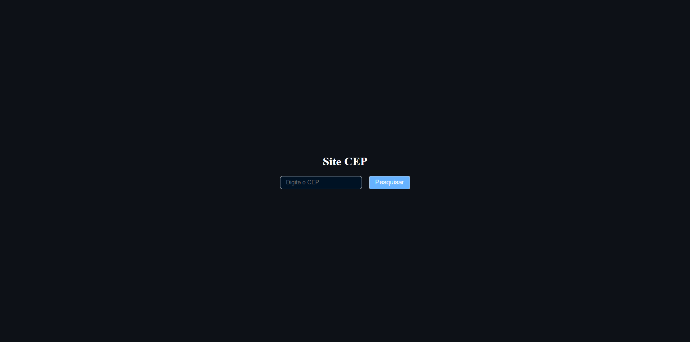

# App CEP

# 📄 Descrição
Aplicação web simples para consulta de CEP utilizando a Brasil API, construída com HTML, CSS e JavaScript em um único arquivo.

# 💻 Sobre o projeto
App CEP é um projeto prático criado para demonstrar o consumo de APIs públicas e manipulação do DOM com JavaScript vanilla.

O objetivo foi criar uma aplicação minimalista e funcional que permite ao usuário buscar informações de endereço (estado, cidade e bairro) através de um CEP válido de 8 dígitos, consumindo a Brasil API de forma assíncrona.
​
# ⚙️ Funcionalidades
- Busca de CEP através da Brasil API

- Validação de entrada (aceita apenas 8 dígitos)

- Exibição de Estado, Cidade e Bairro

- Tratamento de erros (CEP inválido ou não encontrado)

# 🎨 Layout
Interface simples com:

 

- Campo de input para CEP (apenas números)

- Botão de pesquisa com hover effect

- Área de resultados dinâmica

# 🚀 Como executar o projeto
Opção 1: Abrir diretamente no navegador
1. Clone ou baixe o repositório:
```bash
https://github.com/henrymzs/cep-project.git
```
2. Abra o arquivo index.html diretamente no navegador

Opção 2: Com Live Server (VSCode)
1. Instale a extensão Live Server no VSCode
2. Clique com botão direito no arquivo → "Open with Live Server"

# 🛠 Tecnologias
As seguintes ferramentas foram usadas na construção do projeto:

Front-End
- HTML5 - Estrutura semântica

- CSS3 - Estilização inline com dark mode

- JavaScript (ES6+)
   - Fetch API para requisições assíncronas
   - Async/Await
   - Manipulação do DOM
   - Validação de formulários

- API Externa
   - Brasil API - Consulta de CEPs brasileiros
   
# 💪 Como contribuir para o projeto
1. Faça um fork do projeto

2. Crie uma nova branch com sua feature:
```bash
git checkout -b feature/minha-feature
```

3. Commit suas mudanças:
```bash
git commit -m "feat: Minha nova feature"
```

4. Push para a branch:
```bash
git push origin feature/minha-feature
```

5. Abra um Pull Request

# 🦸 Autor

[](https://github.com/henrymzs)
[](https://linkedin.com/in/henry-kaua)
[](mailto:henrykaua21@gmail.com)